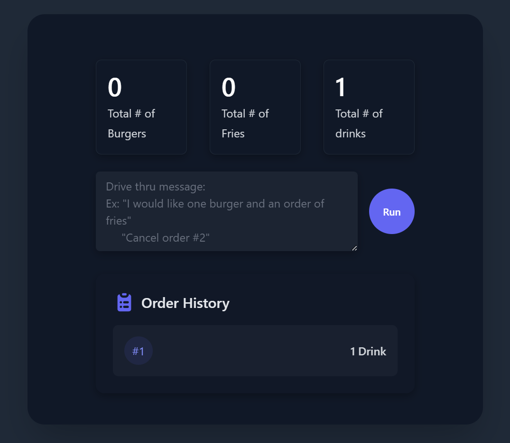
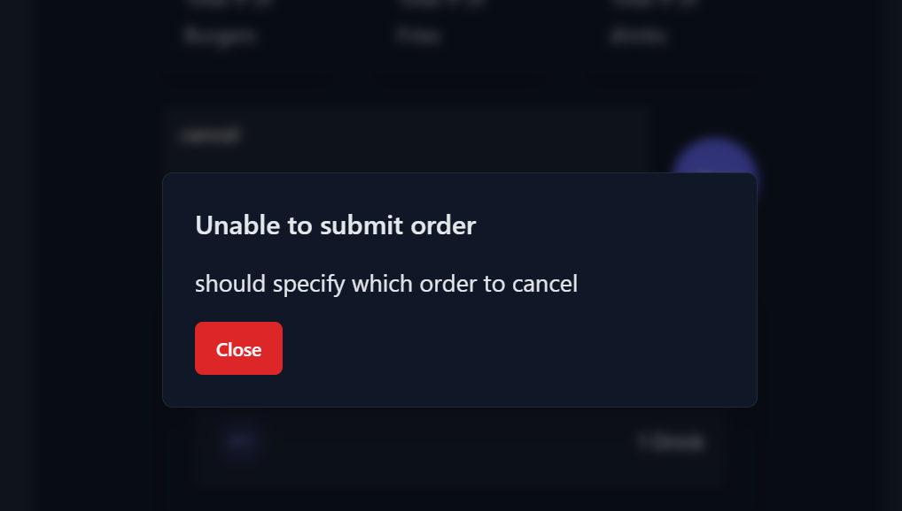

# Mock Drive-Thru AI Ordering System

An intelligent drive-thru ordering system powered by GPT-4o, allowing customers to place and manage food orders using natural language.

## Features

- Natural language order processing
- Support for multiple items and quantities
- Real-time order tracking
- Order cancellation functionality
- Multi-item order support (burgers, fries, drinks)
- Error handling
- Order history display

## Tech Stack

### Backend
- OpenAI GPT-4o-mini
- FastAPI
- Uvicorn (ASGI server)
- Pydantic

### Frontend
- Svelte
- Tailwind CSS
## Screenshots

### Interface


### Error Handling



## System Architecture

- RESTful API backend with FastAPI
- Real-time order processing using GPT-4
- Single-page application frontend with Svelte
- JSON-based communication between frontend and backend

## Setup Instructions

### Backend Setup

1. Navigate to the backend directory:
```bash
cd backend
```

2. Install dependencies:
```bash
poetry install
```

4. Set up your OpenAI API key in 'backend/.env'
```bash
OPENAI_API_KEY='your-api-key-here'
```

5. Start the backend server:
```bash
poetry run uvicorn main:app 
```

### Frontend Setup

1. Navigate to the frontend directory:
```bash
cd frontend
```

2. Install dependencies:
```bash
npm install
```

3. Start the development server:
```bash
npm run dev
```

## Example Usage

### Placing Orders
- "I would like to order a burger"
- "My friend and I would each like a fries and a drink"
- "Three burgers and two drinks please"

### Canceling Orders
- "Please cancel my order, order #2"
- "Cancel orders #2 and #3"
- "Cancel all orders"


## Contributing

1. Fork the repository
2. Create your feature branch
3. Commit your changes
4. Push to the branch
5. Submit a pull request

## License

MIT License
